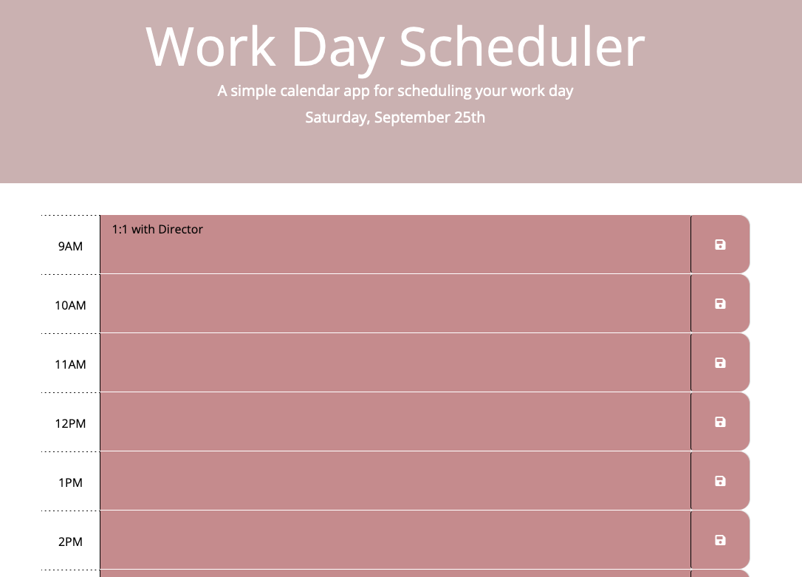

# [Work Day Scheduler](https://avaarm.github.io/day_planner/)

## Description 

This is a frontend Javascript application that utilizes a third-party API called Moment, a time and date library.

## Table of Contents

* [Technologies](#technologies)
* [Application](#Application)
* [Acknowledgements](#acknowledgements)
* [Questions](#questions)

## Technologies

* JavaScript
* Bootstrap
* Moment

## Application 

## Acknowledgements

* [Common templates for user stories](https://en.wikipedia.org/wiki/User_story#Common_templates)
* UW Coding Bootcamp instructional team and classmates
    * test files already provided
    * skeleton of html files already provided
    * htmlRenderer.js already provided

## Questions 

If you have any questions, please contact me on:
GitHub at [avaarm](https://github.com/avaarm)
Email at [Emma](mailto:avaarm95@mail.com)
